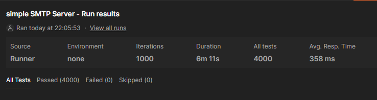
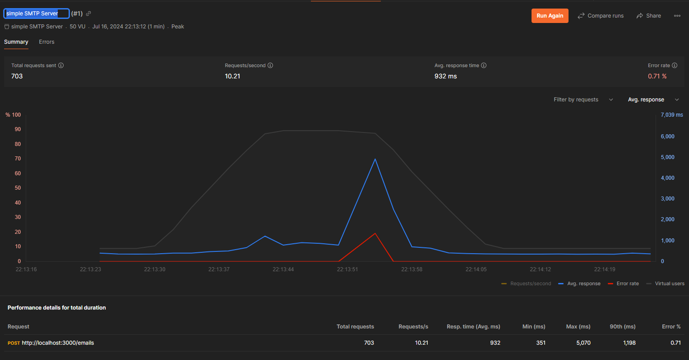
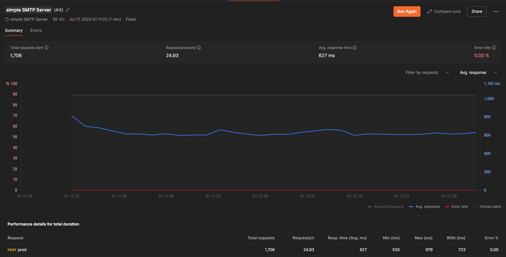

# Email Server

tech stack:

- NestJs
- postgreSQL
- smtp-server
- nodemailer
- mailparser

## Prerequisite

- docker https://docs.docker.com/engine/install/
- Nixpacks https://nixpacks.com/docs/install#installation

## Port

- NestJs app use port 3000
- SMTP Server use port 25

\*If you deployed to Railways, use their internal url, since only one public domain are available

## Run the app locally

```bash
$ pnpm i
$ pnpm run start:dev
$ pnpm run build
```

if you want to run the app from nixpacks

```bash
$ nixpacks build --name email-server .
$ docker run -it --publish 3000:3000 --publish 2525:2525 email-server
```

notice there is 2 port exported, one for the NestJs app and one for the SMTP Server

## Testing

- Local testing





- Prod testing


